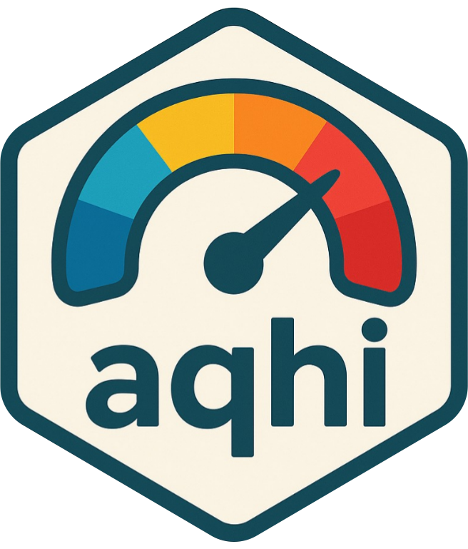

# aqhi 


<!-- badges: start -->

<!-- badges: end -->

The aqhi R package provides the ability to calculate the Canadian Air Quality Health Index (both AQHI and AQHI+), with French translations where possible.

## Installation

``` r
install.packages("aqhi")
```

### Development version 

You can install the development version of aqhi from [GitHub](https://github.com/) with:

``` r
# install.packages("pak")
pak::pak("B-Nilson/aqhi")
```

## Examples

``` r
library(aqhi)

# Make test data
obs <- data.frame(
    date = seq(
        as.POSIXct("2024-01-01 00:00:00"),
        as.POSIXct("2024-01-01 23:00:00"),
        "1 hours"
    ),
    pm25 = 1:101,
    o3 = 1:101,
    no2 = 1:101
)

# Get detailed AQHI information
obs$date |> 
    AQHI(
        pm25_1hr_ugm3 = obs$pm25,
        o3_1hr_ppb = obs$o3,
        no2_1hr_ppb = obs$no2
    )
    
# Get just the AQHI levels
obs$date |> 
    AQHI(
        pm25_1hr_ugm3 = obs$pm25,
        o3_1hr_ppb = obs$o3,
        no2_1hr_ppb = obs$no2,
        detailed = FALSE
    )

# Return French translations
obs$date |> 
    AQHI(
        pm25_1hr_ugm3 = obs$pm25,
        o3_1hr_ppb = obs$o3,
        no2_1hr_ppb = obs$no2,
        language = "fr"
    )

# Just calculate AQHI+ if only PM2.5 data available
obs$date |> AQHI(pm25_1hr_ugm3 = obs$pm25)
obs$date |> AQHI(pm25_1hr_ugm3 = obs$pm25, language = "fr")
obs$date |> AQHI(pm25_1hr_ugm3 = obs$pm25, detailed = FALSE)

# Or directly call AQHI+
obs$pm25 |> AQHI_plus()
obs$pm25 |> AQHI_plus(language = "fr")
obs$pm25 |> AQHI_plus(detailed = FALSE)

# Get risk categories for AQHI levels
risk <- c(NA, 1:10, "+") |> get_risk_category()
risk_fr <- c(NA, 1:10, "+") |> get_risk_category(language = "fr")

# Get health messages for risk levels
risk |> get_health_messages()
risk_fr |> get_health_messages(language = "fr")

# Get colours for AQHI levels
get_aqhi_colours()
obs$pm25 |> AQHI_plus(detailed = FALSE) |> get_aqhi_colours()

```